<a href="https://colab.research.google.com/github/ravi3222/Deep-Learning/blob/master/Variational-Autoencoder/VAE_on_CelebA.ipynb" target="_parent"></a>

## Import Libraries


```python
import numpy as np
import matplotlib.pyplot as plt
import os
import pickle
from keras.layers import Input, Conv2D, Flatten, Dense, Conv2DTranspose, Reshape 
from keras.layers import Lambda, Activation, BatchNormalization, LeakyReLU, Dropout
from keras.models import Model
from keras import backend as K
from keras.optimizers import Adam
from keras.callbacks import ModelCheckpoint, LearningRateScheduler
```

## Building VAE model


```python
class VariationalAutoencoder():
  def __init__(self, input_dim, encoder_conv_filters, encoder_conv_kernel_size, 
               encoder_conv_strides, decoder_conv_t_filters, decoder_conv_t_kernel_size, 
               decoder_conv_t_strides, z_dim, use_dropout= False):
    self.name = 'variational_autoencoder'
    
    self.input_dim = input_dim # size of input image
    self.encoder_conv_filters = encoder_conv_filters # encoder conv layers depth
    self.encoder_conv_kernel_size = encoder_conv_kernel_size # encoder conv kernel size
    self.encoder_conv_strides = encoder_conv_strides # encoder conv strides
    self.decoder_conv_t_filters = decoder_conv_t_filters # decoder conv transpose layers depth
    self.decoder_conv_t_kernel_size = decoder_conv_t_kernel_size # decoder conv kernel size
    self.decoder_conv_t_strides = decoder_conv_t_strides # decoder conv strides
    self.z_dim = z_dim # dimension of latent space
    self.use_dropout = use_dropout # use dropouts or not
    
    self.n_layers_encoder = len(encoder_conv_filters) # number of encoder conv layers
    self.n_layers_decoder = len(decoder_conv_t_filters) # number of decoder conv transpose layers
    
    self._build()

  
  ## BUILD THE FULL VAE MODEL
  def _build(self):
    
    # THE ENCODER 
    # A model that takes an input image and encodes it into the 2D latent space, 
    # by sampling a point from the normal distribution defined by mu and log_var.”

    encoder_input = Input(shape=self.input_dim, name='encoder_input')
    x = encoder_input
    
    for i in range(self.n_layers_encoder):
      conv_layer = Conv2D(filters = self.encoder_conv_filters[i], 
                          kernel_size = self.encoder_conv_kernel_size[i], 
                          strides = self.encoder_conv_strides[i], 
                          padding = 'same', name = 'encoder_conv_' + str(i))
      x = conv_layer(x)
      x = BatchNormalization()(x)
      x = LeakyReLU()(x)
      if self.use_dropout:
        x = Dropout(rate = 0.25)(x)
      
    shape_before_flattening = K.int_shape(x)[1:]
    x = Flatten()(x)
    self.mu = Dense(self.z_dim, name='mu')(x)
    self.log_var = Dense(self.z_dim, name='log_var')(x)
    # We choose to map to the logarithm of the variance, as this can take any real 
    # number in the range (–inf, inf), matching the natural output range from a 
    # neural network unit, whereas variance values are always positive.

    self.encoder_mu_log_var = Model(encoder_input, (self.mu, self.log_var))

    # Now, since we are sampling a random point from an area around mu, the decoder 
    # must ensure that all points in the same neighborhood produce very similar images when 
    # decoded, so that the reconstruction loss remains small.

    def sampling(args):
      mu, log_var = args
      epsilon = K.random_normal(shape=K.shape(mu), mean=0., stddev=1.)
      return mu + K.exp(log_var / 2) * epsilon

    # Latent space
    encoder_output = Lambda(sampling, name='encoder_output')([self.mu, self.log_var])
    
    self.encoder = Model(encoder_input, encoder_output)

    # THE DECODER
    # A model that takes a point in the latent space and decodes it into the original image domain.

    decoder_input = Input(shape=(self.z_dim,), name='decoder_input')
    x = Dense(np.prod(shape_before_flattening))(decoder_input)
    x = Reshape(shape_before_flattening)(x)

    for i in range(self.n_layers_decoder):
      conv_t_layer = Conv2DTranspose(filters = self.decoder_conv_t_filters[i], 
                                     kernel_size = self.decoder_conv_t_kernel_size[i], 
                                     strides = self.decoder_conv_t_strides[i], 
                                     padding = 'same', name = 'decoder_conv_t_' + str(i))

      x = conv_t_layer(x)
      if i < self.n_layers_decoder - 1: # condition for not having bn-leakyrelu-dropout at last layer
        x = BatchNormalization()(x)
        x = LeakyReLU()(x)
        if self.use_dropout:
          x = Dropout(rate = 0.25)(x)
      else:
        x = Activation('sigmoid')(x)

    decoder_output = x
    self.decoder = Model(decoder_input, decoder_output)

    ### THE FULL VAE
    model_input = encoder_input
    model_output = self.decoder(encoder_output)

    self.model = Model(model_input, model_output)

  ## DEFINE THE LOSS FUNCTIONS AND OPTIMIZER
  def compile(self, learning_rate, reco_loss_factor):
    self.learning_rate = learning_rate
    # Binary cross-entropy places heavier penalties on predictions at the extremes 
    # that are badly wrong, so it tends to push pixel predictions to the middle of the 
    # range. This results in less vibrant images. For this reason, we use RMSE as the 
    # loss function.

    def vae_r_loss(y_true, y_pred):
      r_loss = K.mean(K.square(y_true - y_pred), axis = [1,2,3])
      return reco_loss_factor * r_loss # reco_loss_factor ensures balance with the KL divergence loss

    # KL divergence term penalizes the network for encoding observations to mu 
    # and log_var variables that differ significantly from the parameters of a 
    # standard normal distribution, namely mu = 0 and log_var = 0.

    def vae_kl_loss(y_true, y_pred):
      kl_loss =  -0.5 * K.sum(1 + self.log_var - K.square(self.mu) - K.exp(self.log_var), axis = 1)
      return kl_loss

    def vae_loss(y_true, y_pred):
      reco_loss = vae_r_loss(y_true, y_pred)
      kl_loss = vae_kl_loss(y_true, y_pred)
      return  reco_loss + kl_loss

    optimizer = Adam(lr=learning_rate)
    self.model.compile(optimizer=optimizer, loss = vae_loss,  metrics = [vae_r_loss, vae_kl_loss])
```

## Import CelebA dataset


```python
# Mount google drive
from google.colab import drive
drive.mount('/content/drive')
# os.mkdir('data/')
!ls
```

    Mounted at /content/drive
    celeba-dataset.zip  data  drive  img_align_celeba  sample_data
    


```python
!cp -r 'drive/My Drive/celeba-dataset.zip' .
```


```python
os.mkdir('data/')
!unzip -qq 'celeba-dataset.zip' -d 'data/'
```

## Define Parameters


```python
from glob import glob

DATA_FOLDER = 'data/img_align_celeba/'
IMAGE_FOLDER = 'data/img_align_celeba/img_align_celeba/'
INPUT_DIM = (128,128,3)
BATCH_SIZE = 32
filenames = np.array(glob(os.path.join(DATA_FOLDER, '*/*.jpg')))
NUM_IMAGES = len(filenames)
LEARNING_RATE = 0.0005
R_LOSS_FACTOR = 10000
EPOCHS = 10
```

## Data flow 


```python
# Import libraries
from keras.preprocessing.image import ImageDataGenerator

data_gen = ImageDataGenerator(rescale=1./255)
data_flow = data_gen.flow_from_directory(DATA_FOLDER, target_size = INPUT_DIM[:2], 
                                         batch_size = BATCH_SIZE, shuffle = True, 
                                         class_mode = 'input')
```

    Found 202599 images belonging to 1 classes.
    

## Define the Arch


```python
vae = VariationalAutoencoder(input_dim = INPUT_DIM, 
                             encoder_conv_filters=[32,64,64,64], 
                             encoder_conv_kernel_size=[3,3,3,3], 
                             encoder_conv_strides=[2,2,2,2], 
                             decoder_conv_t_filters=[64,64,32,3], 
                             decoder_conv_t_kernel_size=[3,3,3,3], 
                             decoder_conv_t_strides=[2,2,2,2], 
                             z_dim=200, 
                             use_dropout=True)
```

## Encoder Model Summary 


```python
vae.encoder.summary()
```

    Model: "model_10"
    __________________________________________________________________________________________________
    Layer (type)                    Output Shape         Param #     Connected to                     
    ==================================================================================================
    encoder_input (InputLayer)      (None, 128, 128, 3)  0                                            
    __________________________________________________________________________________________________
    encoder_conv_0 (Conv2D)         (None, 64, 64, 32)   896         encoder_input[0][0]              
    __________________________________________________________________________________________________
    batch_normalization_15 (BatchNo (None, 64, 64, 32)   128         encoder_conv_0[0][0]             
    __________________________________________________________________________________________________
    leaky_re_lu_15 (LeakyReLU)      (None, 64, 64, 32)   0           batch_normalization_15[0][0]     
    __________________________________________________________________________________________________
    dropout_15 (Dropout)            (None, 64, 64, 32)   0           leaky_re_lu_15[0][0]             
    __________________________________________________________________________________________________
    encoder_conv_1 (Conv2D)         (None, 32, 32, 64)   18496       dropout_15[0][0]                 
    __________________________________________________________________________________________________
    batch_normalization_16 (BatchNo (None, 32, 32, 64)   256         encoder_conv_1[0][0]             
    __________________________________________________________________________________________________
    leaky_re_lu_16 (LeakyReLU)      (None, 32, 32, 64)   0           batch_normalization_16[0][0]     
    __________________________________________________________________________________________________
    dropout_16 (Dropout)            (None, 32, 32, 64)   0           leaky_re_lu_16[0][0]             
    __________________________________________________________________________________________________
    encoder_conv_2 (Conv2D)         (None, 16, 16, 64)   36928       dropout_16[0][0]                 
    __________________________________________________________________________________________________
    batch_normalization_17 (BatchNo (None, 16, 16, 64)   256         encoder_conv_2[0][0]             
    __________________________________________________________________________________________________
    leaky_re_lu_17 (LeakyReLU)      (None, 16, 16, 64)   0           batch_normalization_17[0][0]     
    __________________________________________________________________________________________________
    dropout_17 (Dropout)            (None, 16, 16, 64)   0           leaky_re_lu_17[0][0]             
    __________________________________________________________________________________________________
    encoder_conv_3 (Conv2D)         (None, 8, 8, 64)     36928       dropout_17[0][0]                 
    __________________________________________________________________________________________________
    batch_normalization_18 (BatchNo (None, 8, 8, 64)     256         encoder_conv_3[0][0]             
    __________________________________________________________________________________________________
    leaky_re_lu_18 (LeakyReLU)      (None, 8, 8, 64)     0           batch_normalization_18[0][0]     
    __________________________________________________________________________________________________
    dropout_18 (Dropout)            (None, 8, 8, 64)     0           leaky_re_lu_18[0][0]             
    __________________________________________________________________________________________________
    flatten_3 (Flatten)             (None, 4096)         0           dropout_18[0][0]                 
    __________________________________________________________________________________________________
    mu (Dense)                      (None, 200)          819400      flatten_3[0][0]                  
    __________________________________________________________________________________________________
    log_var (Dense)                 (None, 200)          819400      flatten_3[0][0]                  
    __________________________________________________________________________________________________
    encoder_output (Lambda)         (None, 200)          0           mu[0][0]                         
                                                                     log_var[0][0]                    
    ==================================================================================================
    Total params: 1,732,944
    Trainable params: 1,732,496
    Non-trainable params: 448
    __________________________________________________________________________________________________
    

## Decoder Model Summary


```python
vae.decoder.summary()
```

    Model: "model_11"
    _________________________________________________________________
    Layer (type)                 Output Shape              Param #   
    =================================================================
    decoder_input (InputLayer)   (None, 200)               0         
    _________________________________________________________________
    dense_3 (Dense)              (None, 4096)              823296    
    _________________________________________________________________
    reshape_3 (Reshape)          (None, 8, 8, 64)          0         
    _________________________________________________________________
    decoder_conv_t_0 (Conv2DTran (None, 16, 16, 64)        36928     
    _________________________________________________________________
    batch_normalization_19 (Batc (None, 16, 16, 64)        256       
    _________________________________________________________________
    leaky_re_lu_19 (LeakyReLU)   (None, 16, 16, 64)        0         
    _________________________________________________________________
    dropout_19 (Dropout)         (None, 16, 16, 64)        0         
    _________________________________________________________________
    decoder_conv_t_1 (Conv2DTran (None, 32, 32, 64)        36928     
    _________________________________________________________________
    batch_normalization_20 (Batc (None, 32, 32, 64)        256       
    _________________________________________________________________
    leaky_re_lu_20 (LeakyReLU)   (None, 32, 32, 64)        0         
    _________________________________________________________________
    dropout_20 (Dropout)         (None, 32, 32, 64)        0         
    _________________________________________________________________
    decoder_conv_t_2 (Conv2DTran (None, 64, 64, 32)        18464     
    _________________________________________________________________
    batch_normalization_21 (Batc (None, 64, 64, 32)        128       
    _________________________________________________________________
    leaky_re_lu_21 (LeakyReLU)   (None, 64, 64, 32)        0         
    _________________________________________________________________
    dropout_21 (Dropout)         (None, 64, 64, 32)        0         
    _________________________________________________________________
    decoder_conv_t_3 (Conv2DTran (None, 128, 128, 3)       867       
    _________________________________________________________________
    activation_3 (Activation)    (None, 128, 128, 3)       0         
    =================================================================
    Total params: 917,123
    Trainable params: 916,803
    Non-trainable params: 320
    _________________________________________________________________
    

## Train the VAE Model


```python
vae.compile(LEARNING_RATE, R_LOSS_FACTOR)
```


```python
def step_decay_schedule(initial_lr, decay_factor=0.5, step_size=1):
    # Wrapper function to create a LearningRateScheduler with step decay schedule
    def schedule(epoch):
        new_lr = initial_lr * (decay_factor ** np.floor(epoch/step_size))
        return new_lr
    return LearningRateScheduler(schedule)

lr_sched = step_decay_schedule(initial_lr= LEARNING_RATE, decay_factor=1, step_size=1)
checkpoint = ModelCheckpoint('weights_vae.h5', 
                             save_weights_only = True, monitor='vae_loss', verbose=1)
```

### Run 1 


```python
vae.model.fit_generator(data_flow, shuffle = True, epochs = EPOCHS, 
                        steps_per_epoch = NUM_IMAGES // BATCH_SIZE,
                        callbacks = [checkpoint, lr_sched])
```

    Epoch 1/10
    6331/6331 [==============================] - 454s 72ms/step - loss: 225.9994 - vae_r_loss: 166.7167 - vae_kl_loss: 59.2827
    
    Epoch 00001: saving model to weights_vae.h5
    Epoch 2/10
    6331/6331 [==============================] - 464s 73ms/step - loss: 224.5138 - vae_r_loss: 165.3294 - vae_kl_loss: 59.1844
    
    Epoch 00002: saving model to weights_vae.h5
    Epoch 3/10
    6331/6331 [==============================] - 461s 73ms/step - loss: 223.4622 - vae_r_loss: 164.3356 - vae_kl_loss: 59.1266
    
    Epoch 00003: saving model to weights_vae.h5
    Epoch 4/10
    6331/6331 [==============================] - 461s 73ms/step - loss: 222.8144 - vae_r_loss: 163.7033 - vae_kl_loss: 59.1111
    
    Epoch 00004: saving model to weights_vae.h5
    Epoch 5/10
    6331/6331 [==============================] - 464s 73ms/step - loss: 222.3435 - vae_r_loss: 163.2447 - vae_kl_loss: 59.0988
    
    Epoch 00005: saving model to weights_vae.h5
    Epoch 6/10
    6331/6331 [==============================] - 466s 74ms/step - loss: 221.8738 - vae_r_loss: 162.7967 - vae_kl_loss: 59.0771
    
    Epoch 00006: saving model to weights_vae.h5
    Epoch 7/10
    6331/6331 [==============================] - 465s 74ms/step - loss: 221.4692 - vae_r_loss: 162.4014 - vae_kl_loss: 59.0678
    
    Epoch 00007: saving model to weights_vae.h5
    Epoch 8/10
    6331/6331 [==============================] - 463s 73ms/step - loss: 221.1435 - vae_r_loss: 162.0698 - vae_kl_loss: 59.0737
    
    Epoch 00008: saving model to weights_vae.h5
    Epoch 9/10
    2005/6331 [========>.....................] - ETA: 5:14 - loss: 221.1735 - vae_r_loss: 162.1305 - vae_kl_loss: 59.0430Buffered data was truncated after reaching the output size limit.

### Run 2


```python
# load the model after 50 epochs
vae.model.load_weights("weights_vae.h5")
```


```python
vae.model.fit_generator(data_flow, shuffle = True, epochs = EPOCHS, 
                        steps_per_epoch = NUM_IMAGES // BATCH_SIZE,
                        callbacks = [checkpoint, lr_sched])
```

    Epoch 1/10
    6331/6331 [==============================] - 465s 73ms/step - loss: 220.2866 - vae_r_loss: 161.2619 - vae_kl_loss: 59.0247
    
    Epoch 00001: saving model to weights_vae.h5
    Epoch 2/10
    6331/6331 [==============================] - 465s 73ms/step - loss: 220.2841 - vae_r_loss: 161.2434 - vae_kl_loss: 59.0407
    
    Epoch 00002: saving model to weights_vae.h5
    Epoch 3/10
    6331/6331 [==============================] - 464s 73ms/step - loss: 219.9399 - vae_r_loss: 160.9275 - vae_kl_loss: 59.0125
    
    Epoch 00003: saving model to weights_vae.h5
    Epoch 4/10
    6331/6331 [==============================] - 470s 74ms/step - loss: 219.8498 - vae_r_loss: 160.8276 - vae_kl_loss: 59.0222
    
    Epoch 00004: saving model to weights_vae.h5
    Epoch 5/10
    6331/6331 [==============================] - 468s 74ms/step - loss: 219.6698 - vae_r_loss: 160.6604 - vae_kl_loss: 59.0094
    
    Epoch 00005: saving model to weights_vae.h5
    Epoch 6/10
    6331/6331 [==============================] - 469s 74ms/step - loss: 219.6927 - vae_r_loss: 160.6672 - vae_kl_loss: 59.0255
    
    Epoch 00006: saving model to weights_vae.h5
    Epoch 7/10
    6331/6331 [==============================] - 470s 74ms/step - loss: 219.5049 - vae_r_loss: 160.4876 - vae_kl_loss: 59.0173
    
    Epoch 00007: saving model to weights_vae.h5
    Epoch 8/10
    6331/6331 [==============================] - 469s 74ms/step - loss: 219.4274 - vae_r_loss: 160.3982 - vae_kl_loss: 59.0293
    
    Epoch 00008: saving model to weights_vae.h5
    Epoch 9/10
    2005/6331 [========>.....................] - ETA: 5:21 - loss: 219.2733 - vae_r_loss: 160.2391 - vae_kl_loss: 59.0342Buffered data was truncated after reaching the output size limit.

## Load the model for Generation after 100 epochs


```python
vae.model.load_weights('weights_vae.h5')
```

**The latent space of the VAE is truly a continuous space that can be traversed and explored to generate a multitude of different human faces. Let's see some of its applications.**


## Newly generated faces

Generating faces from random latent space normal distribution


```python
n_to_show = 30
znew = np.random.normal(size = (n_to_show,vae.z_dim))
reconst = vae.decoder.predict(np.array(znew))

fig = plt.figure(figsize=(18, 5))
fig.subplots_adjust(hspace=0.4, wspace=0.4)
for i in range(n_to_show):
    ax = fig.add_subplot(3, 10, i+1)
    ax.imshow(reconst[i, :,:,:])
    ax.axis('off')
plt.show()
```


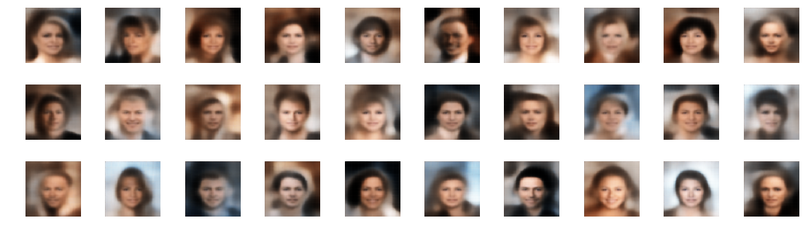


## Reconstructing faces

Reconstructing faces from input images


```python
example_images= data_flow[0][0]
z_points = vae.encoder.predict(example_images)
reconst_images = vae.decoder.predict(z_points)

fig = plt.figure(figsize=(15, 3))
fig.subplots_adjust(hspace=0.4, wspace=0.4)

for i in range(10):
    img = example_images[i].squeeze()
    sub = fig.add_subplot(2, 10, i+1)
    sub.axis('off')        
    sub.imshow(img)

for i in range(10):
    img = reconst_images[i].squeeze()
    sub = fig.add_subplot(2, 10, i+11)
    sub.axis('off')
    sub.imshow(img)
```


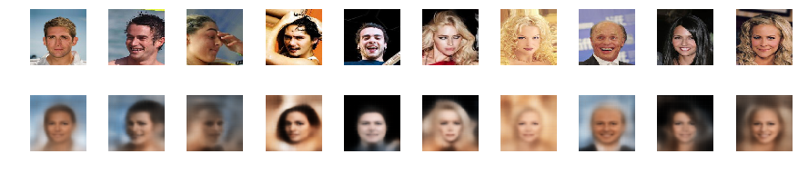


**Its very evident that VAEs tend to produce softer images that blurred boundaries.**

## Feature Manipulation

For features in dataset we add attributes related to the celebrity faces


```python
import pandas as pd
attr = pd.read_csv('list_attr_celeba.csv')
attr.head()
```


<div>
<style scoped>
    .dataframe tbody tr th:only-of-type {
        vertical-align: middle;
    }

    .dataframe tbody tr th {
        vertical-align: top;
    }

    .dataframe thead th {
        text-align: right;
    }
</style>
<table border="1" class="dataframe">
  <thead>
    <tr style="text-align: right;">
      <th></th>
      <th>File_name</th>
      <th>5_o_Clock_Shadow</th>
      <th>Arched_Eyebrows</th>
      <th>Attractive</th>
      <th>Bags_Under_Eyes</th>
      <th>Bald</th>
      <th>Bangs</th>
      <th>Big_Lips</th>
      <th>Big_Nose</th>
      <th>Black_Hair</th>
      <th>Blond_Hair</th>
      <th>Blurry</th>
      <th>Brown_Hair</th>
      <th>Bushy_Eyebrows</th>
      <th>Chubby</th>
      <th>Double_Chin</th>
      <th>Eyeglasses</th>
      <th>Goatee</th>
      <th>Gray_Hair</th>
      <th>Heavy_Makeup</th>
      <th>High_Cheekbones</th>
      <th>Male</th>
      <th>Mouth_Slightly_Open</th>
      <th>Mustache</th>
      <th>Narrow_Eyes</th>
      <th>No_Beard</th>
      <th>Oval_Face</th>
      <th>Pale_Skin</th>
      <th>Pointy_Nose</th>
      <th>Receding_Hairline</th>
      <th>Rosy_Cheeks</th>
      <th>Sideburns</th>
      <th>Smiling</th>
      <th>Straight_Hair</th>
      <th>Wavy_Hair</th>
      <th>Wearing_Earrings</th>
      <th>Wearing_Hat</th>
      <th>Wearing_Lipstick</th>
      <th>Wearing_Necklace</th>
      <th>Wearing_Necktie</th>
      <th>Young</th>
    </tr>
  </thead>
  <tbody>
    <tr>
      <th>0</th>
      <td>000001.jpg</td>
      <td>-1</td>
      <td>1</td>
      <td>1</td>
      <td>-1</td>
      <td>-1</td>
      <td>-1</td>
      <td>-1</td>
      <td>-1</td>
      <td>-1</td>
      <td>-1</td>
      <td>-1</td>
      <td>1</td>
      <td>-1</td>
      <td>-1</td>
      <td>-1</td>
      <td>-1</td>
      <td>-1</td>
      <td>-1</td>
      <td>1</td>
      <td>1</td>
      <td>-1</td>
      <td>1</td>
      <td>-1</td>
      <td>-1</td>
      <td>1</td>
      <td>-1</td>
      <td>-1</td>
      <td>1</td>
      <td>-1</td>
      <td>-1</td>
      <td>-1</td>
      <td>1</td>
      <td>1</td>
      <td>-1</td>
      <td>1</td>
      <td>-1</td>
      <td>1</td>
      <td>-1</td>
      <td>-1</td>
      <td>1</td>
    </tr>
    <tr>
      <th>1</th>
      <td>000002.jpg</td>
      <td>-1</td>
      <td>-1</td>
      <td>-1</td>
      <td>1</td>
      <td>-1</td>
      <td>-1</td>
      <td>-1</td>
      <td>1</td>
      <td>-1</td>
      <td>-1</td>
      <td>-1</td>
      <td>1</td>
      <td>-1</td>
      <td>-1</td>
      <td>-1</td>
      <td>-1</td>
      <td>-1</td>
      <td>-1</td>
      <td>-1</td>
      <td>1</td>
      <td>-1</td>
      <td>1</td>
      <td>-1</td>
      <td>-1</td>
      <td>1</td>
      <td>-1</td>
      <td>-1</td>
      <td>-1</td>
      <td>-1</td>
      <td>-1</td>
      <td>-1</td>
      <td>1</td>
      <td>-1</td>
      <td>-1</td>
      <td>-1</td>
      <td>-1</td>
      <td>-1</td>
      <td>-1</td>
      <td>-1</td>
      <td>1</td>
    </tr>
    <tr>
      <th>2</th>
      <td>000003.jpg</td>
      <td>-1</td>
      <td>-1</td>
      <td>-1</td>
      <td>-1</td>
      <td>-1</td>
      <td>-1</td>
      <td>1</td>
      <td>-1</td>
      <td>-1</td>
      <td>-1</td>
      <td>1</td>
      <td>-1</td>
      <td>-1</td>
      <td>-1</td>
      <td>-1</td>
      <td>-1</td>
      <td>-1</td>
      <td>-1</td>
      <td>-1</td>
      <td>-1</td>
      <td>1</td>
      <td>-1</td>
      <td>-1</td>
      <td>1</td>
      <td>1</td>
      <td>-1</td>
      <td>-1</td>
      <td>1</td>
      <td>-1</td>
      <td>-1</td>
      <td>-1</td>
      <td>-1</td>
      <td>-1</td>
      <td>1</td>
      <td>-1</td>
      <td>-1</td>
      <td>-1</td>
      <td>-1</td>
      <td>-1</td>
      <td>1</td>
    </tr>
    <tr>
      <th>3</th>
      <td>000004.jpg</td>
      <td>-1</td>
      <td>-1</td>
      <td>1</td>
      <td>-1</td>
      <td>-1</td>
      <td>-1</td>
      <td>-1</td>
      <td>-1</td>
      <td>-1</td>
      <td>-1</td>
      <td>-1</td>
      <td>-1</td>
      <td>-1</td>
      <td>-1</td>
      <td>-1</td>
      <td>-1</td>
      <td>-1</td>
      <td>-1</td>
      <td>-1</td>
      <td>-1</td>
      <td>-1</td>
      <td>-1</td>
      <td>-1</td>
      <td>-1</td>
      <td>1</td>
      <td>-1</td>
      <td>-1</td>
      <td>1</td>
      <td>-1</td>
      <td>-1</td>
      <td>-1</td>
      <td>-1</td>
      <td>1</td>
      <td>-1</td>
      <td>1</td>
      <td>-1</td>
      <td>1</td>
      <td>1</td>
      <td>-1</td>
      <td>1</td>
    </tr>
    <tr>
      <th>4</th>
      <td>000005.jpg</td>
      <td>-1</td>
      <td>1</td>
      <td>1</td>
      <td>-1</td>
      <td>-1</td>
      <td>-1</td>
      <td>1</td>
      <td>-1</td>
      <td>-1</td>
      <td>-1</td>
      <td>-1</td>
      <td>-1</td>
      <td>-1</td>
      <td>-1</td>
      <td>-1</td>
      <td>-1</td>
      <td>-1</td>
      <td>-1</td>
      <td>1</td>
      <td>-1</td>
      <td>-1</td>
      <td>-1</td>
      <td>-1</td>
      <td>1</td>
      <td>1</td>
      <td>-1</td>
      <td>-1</td>
      <td>1</td>
      <td>-1</td>
      <td>-1</td>
      <td>-1</td>
      <td>-1</td>
      <td>-1</td>
      <td>-1</td>
      <td>-1</td>
      <td>-1</td>
      <td>1</td>
      <td>-1</td>
      <td>-1</td>
      <td>1</td>
    </tr>
  </tbody>
</table>
</div>


### Functions for getting vectors for corresponding label


```python
def get_vector_from_label(label, batch_size):
    
    data_gen = ImageDataGenerator(rescale=1./255)
    data_flow_label = data_gen.flow_from_dataframe(attr, IMAGE_FOLDER, 
                                                   x_col='File_name', 
                                                   y_col = label,
                                                   target_size=INPUT_DIM[:2] , 
                                                   class_mode='other', 
                                                   batch_size=batch_size, 
                                                   shuffle=True)

    # Initiating vectors 
    origin = np.zeros(shape = vae.z_dim, dtype = 'float32')
    current_sum_POS = np.zeros(shape = vae.z_dim, dtype = 'float32')
    current_n_POS = 0
    current_mean_POS = np.zeros(shape = vae.z_dim, dtype = 'float32')

    current_sum_NEG = np.zeros(shape = vae.z_dim, dtype = 'float32')
    current_n_NEG = 0
    current_mean_NEG = np.zeros(shape = vae.z_dim, dtype = 'float32')

    current_vector = np.zeros(shape = vae.z_dim, dtype = 'float32')
    current_dist = 0

    print('label: ' + label)
    print('images : POS move : NEG move :distance : del distance')
    while(current_n_POS < 10000):

        batch = next(data_flow_label)
        im = batch[0]
        attribute = batch[1]

        z = vae.encoder.predict(np.array(im))

        z_POS = z[attribute==1]
        z_NEG = z[attribute==-1]

        # For positive attributes
        if len(z_POS) > 0:
            current_sum_POS = current_sum_POS + np.sum(z_POS, axis = 0)
            current_n_POS += len(z_POS)
            new_mean_POS = current_sum_POS / current_n_POS
            movement_POS = np.linalg.norm(new_mean_POS-current_mean_POS)

        # For negative attributes
        if len(z_NEG) > 0: 
            current_sum_NEG = current_sum_NEG + np.sum(z_NEG, axis = 0)
            current_n_NEG += len(z_NEG)
            new_mean_NEG = current_sum_NEG / current_n_NEG
            movement_NEG = np.linalg.norm(new_mean_NEG-current_mean_NEG)

        current_vector = new_mean_POS-new_mean_NEG
        new_dist = np.linalg.norm(current_vector)
        dist_change = new_dist - current_dist


        print(str(current_n_POS)
              + '    : ' + str(np.round(movement_POS,3))
              + '    : ' + str(np.round(movement_NEG,3))
              + '    : ' + str(np.round(new_dist,3))
              + '    : ' + str(np.round(dist_change,3))
             )

        current_mean_POS = np.copy(new_mean_POS)
        current_mean_NEG = np.copy(new_mean_NEG)
        current_dist = np.copy(new_dist)

        if np.sum([movement_POS, movement_NEG]) < 0.08:
            current_vector = current_vector / current_dist
            print('Found the ' + label + ' vector')
            break

    return current_vector
```


```python
# Respective attribute vectors
BATCH_SIZE = 500
attractive_vec = get_vector_from_label('Attractive', BATCH_SIZE)
mouth_open_vec = get_vector_from_label('Mouth_Slightly_Open', BATCH_SIZE)
smiling_vec = get_vector_from_label('Smiling', BATCH_SIZE)
lipstick_vec = get_vector_from_label('Wearing_Lipstick', BATCH_SIZE)
young_vec = get_vector_from_label('High_Cheekbones', BATCH_SIZE)
male_vec = get_vector_from_label('Male', BATCH_SIZE)
eyeglasses_vec = get_vector_from_label('Eyeglasses', BATCH_SIZE)
blonde_vec = get_vector_from_label('Blond_Hair', BATCH_SIZE)
```

    Found 202599 validated image filenames.
    label: Attractive
    images : POS move : NEG move :distance : del distance
    267    : 1.044    : 0.989    : 1.556    : 1.556
    534    : 0.61    : 0.672    : 1.325    : -0.231
    772    : 0.342    : 0.44    : 1.16    : -0.166
    1019    : 0.23    : 0.291    : 1.129    : -0.031
    1270    : 0.199    : 0.207    : 1.067    : -0.062
    1525    : 0.155    : 0.161    : 1.047    : -0.02
    1778    : 0.136    : 0.139    : 1.029    : -0.018
    2025    : 0.117    : 0.121    : 1.04    : 0.011
    2290    : 0.106    : 0.104    : 1.017    : -0.023
    2536    : 0.082    : 0.102    : 1.023    : 0.005
    2784    : 0.078    : 0.084    : 1.024    : 0.001
    3053    : 0.077    : 0.077    : 1.015    : -0.009
    3301    : 0.074    : 0.075    : 1.011    : -0.004
    3551    : 0.064    : 0.066    : 1.002    : -0.009
    3801    : 0.057    : 0.065    : 0.998    : -0.004
    4051    : 0.059    : 0.062    : 0.996    : -0.002
    4315    : 0.056    : 0.055    : 1.002    : 0.007
    4580    : 0.052    : 0.047    : 1.003    : 0.001
    4822    : 0.041    : 0.049    : 1.002    : -0.001
    5083    : 0.044    : 0.047    : 0.999    : -0.003
    5340    : 0.041    : 0.04    : 0.998    : -0.001
    5584    : 0.04    : 0.043    : 0.991    : -0.007
    5854    : 0.038    : 0.041    : 0.984    : -0.007
    Found the Attractive vector
    Found 202599 validated image filenames.
    label: Mouth_Slightly_Open
    images : POS move : NEG move :distance : del distance
    252    : 0.962    : 1.056    : 1.535    : 1.535
    490    : 0.667    : 0.673    : 1.265    : -0.27
    739    : 0.341    : 0.345    : 1.16    : -0.105
    998    : 0.255    : 0.266    : 1.096    : -0.063
    1234    : 0.202    : 0.185    : 1.084    : -0.013
    1453    : 0.155    : 0.173    : 1.062    : -0.021
    1683    : 0.137    : 0.14    : 1.04    : -0.022
    1923    : 0.116    : 0.12    : 1.026    : -0.014
    2155    : 0.098    : 0.116    : 1.02    : -0.006
    2412    : 0.11    : 0.084    : 1.032    : 0.012
    2651    : 0.089    : 0.081    : 1.039    : 0.007
    2908    : 0.078    : 0.075    : 1.038    : -0.0
    3146    : 0.078    : 0.07    : 1.028    : -0.01
    3390    : 0.074    : 0.068    : 1.021    : -0.007
    3626    : 0.061    : 0.062    : 1.019    : -0.002
    3871    : 0.061    : 0.058    : 1.024    : 0.005
    4111    : 0.051    : 0.049    : 1.017    : -0.006
    4357    : 0.052    : 0.045    : 1.017    : -0.0
    4591    : 0.05    : 0.046    : 1.013    : -0.004
    4826    : 0.047    : 0.048    : 1.005    : -0.009
    5077    : 0.046    : 0.041    : 0.997    : -0.007
    5313    : 0.044    : 0.042    : 0.993    : -0.004
    5563    : 0.043    : 0.037    : 0.998    : 0.005
    5811    : 0.039    : 0.04    : 1.0    : 0.002
    Found the Mouth_Slightly_Open vector
    Found 202599 validated image filenames.
    label: Smiling
    images : POS move : NEG move :distance : del distance
    228    : 1.138    : 1.067    : 1.759    : 1.759
    468    : 0.637    : 0.618    : 1.445    : -0.314
    718    : 0.402    : 0.331    : 1.334    : -0.11
    946    : 0.269    : 0.282    : 1.279    : -0.056
    1192    : 0.193    : 0.183    : 1.231    : -0.048
    1429    : 0.17    : 0.165    : 1.217    : -0.014
    1694    : 0.151    : 0.134    : 1.231    : 0.015
    1939    : 0.105    : 0.122    : 1.222    : -0.009
    2202    : 0.104    : 0.109    : 1.218    : -0.004
    2430    : 0.09    : 0.102    : 1.211    : -0.006
    2690    : 0.093    : 0.08    : 1.204    : -0.007
    2929    : 0.077    : 0.078    : 1.199    : -0.005
    3172    : 0.069    : 0.07    : 1.207    : 0.008
    3399    : 0.063    : 0.062    : 1.199    : -0.008
    3645    : 0.061    : 0.058    : 1.198    : -0.001
    3895    : 0.053    : 0.058    : 1.194    : -0.004
    4130    : 0.054    : 0.054    : 1.192    : -0.002
    4368    : 0.047    : 0.052    : 1.198    : 0.006
    4617    : 0.051    : 0.049    : 1.191    : -0.007
    4855    : 0.041    : 0.043    : 1.193    : 0.002
    5106    : 0.045    : 0.043    : 1.197    : 0.004
    5329    : 0.04    : 0.042    : 1.196    : -0.001
    5570    : 0.042    : 0.039    : 1.189    : -0.006
    5823    : 0.039    : 0.038    : 1.189    : -0.001
    Found the Smiling vector
    Found 202599 validated image filenames.
    label: Wearing_Lipstick
    images : POS move : NEG move :distance : del distance
    250    : 1.033    : 0.999    : 1.614    : 1.614
    489    : 0.607    : 0.636    : 1.454    : -0.16
    707    : 0.327    : 0.375    : 1.4    : -0.055
    959    : 0.268    : 0.278    : 1.379    : -0.021
    1166    : 0.19    : 0.203    : 1.357    : -0.021
    1406    : 0.179    : 0.148    : 1.31    : -0.047
    1655    : 0.13    : 0.137    : 1.279    : -0.031
    1886    : 0.116    : 0.114    : 1.27    : -0.01
    2113    : 0.095    : 0.102    : 1.263    : -0.007
    2355    : 0.092    : 0.087    : 1.249    : -0.014
    2602    : 0.095    : 0.085    : 1.245    : -0.004
    2846    : 0.081    : 0.073    : 1.234    : -0.011
    3055    : 0.075    : 0.069    : 1.228    : -0.005
    3305    : 0.073    : 0.066    : 1.228    : -0.001
    3543    : 0.059    : 0.061    : 1.229    : 0.001
    3791    : 0.058    : 0.052    : 1.223    : -0.006
    4035    : 0.052    : 0.048    : 1.221    : -0.002
    4285    : 0.051    : 0.048    : 1.219    : -0.002
    4520    : 0.054    : 0.049    : 1.216    : -0.003
    4746    : 0.044    : 0.044    : 1.217    : 0.001
    4977    : 0.043    : 0.043    : 1.219    : 0.001
    5204    : 0.045    : 0.041    : 1.213    : -0.006
    5452    : 0.042    : 0.038    : 1.215    : 0.002
    Found the Wearing_Lipstick vector
    Found 202599 validated image filenames.
    label: High_Cheekbones
    images : POS move : NEG move :distance : del distance
    212    : 1.11    : 0.901    : 1.568    : 1.568
    430    : 0.719    : 0.566    : 1.239    : -0.328
    652    : 0.35    : 0.345    : 1.193    : -0.047
    876    : 0.281    : 0.235    : 1.128    : -0.064
    1082    : 0.208    : 0.203    : 1.104    : -0.024
    1304    : 0.176    : 0.148    : 1.064    : -0.04
    1523    : 0.134    : 0.116    : 1.052    : -0.012
    1736    : 0.113    : 0.105    : 1.064    : 0.012
    1962    : 0.112    : 0.094    : 1.053    : -0.011
    2190    : 0.101    : 0.084    : 1.033    : -0.02
    2413    : 0.084    : 0.076    : 1.024    : -0.009
    2637    : 0.09    : 0.08    : 1.023    : -0.001
    2874    : 0.077    : 0.062    : 1.024    : 0.001
    3120    : 0.074    : 0.055    : 1.018    : -0.006
    3353    : 0.064    : 0.062    : 1.016    : -0.001
    3568    : 0.051    : 0.061    : 1.012    : -0.004
    3782    : 0.059    : 0.051    : 1.013    : 0.001
    4006    : 0.052    : 0.049    : 1.018    : 0.005
    4239    : 0.054    : 0.044    : 1.014    : -0.004
    4472    : 0.051    : 0.041    : 1.014    : 0.0
    4713    : 0.047    : 0.04    : 1.019    : 0.004
    4929    : 0.042    : 0.042    : 1.021    : 0.003
    5153    : 0.04    : 0.038    : 1.019    : -0.003
    Found the High_Cheekbones vector
    Found 202599 validated image filenames.
    label: Male
    images : POS move : NEG move :distance : del distance
    219    : 1.224    : 1.045    : 1.811    : 1.811
    445    : 0.694    : 0.574    : 1.619    : -0.191
    647    : 0.353    : 0.366    : 1.475    : -0.144
    860    : 0.266    : 0.252    : 1.436    : -0.04
    1054    : 0.198    : 0.199    : 1.396    : -0.04
    1265    : 0.173    : 0.15    : 1.361    : -0.034
    1467    : 0.147    : 0.126    : 1.356    : -0.005
    1694    : 0.123    : 0.114    : 1.337    : -0.018
    1902    : 0.113    : 0.091    : 1.328    : -0.01
    2121    : 0.112    : 0.091    : 1.307    : -0.021
    2328    : 0.088    : 0.085    : 1.287    : -0.02
    2539    : 0.093    : 0.07    : 1.286    : -0.001
    2747    : 0.077    : 0.066    : 1.281    : -0.004
    2931    : 0.066    : 0.064    : 1.276    : -0.006
    3123    : 0.059    : 0.057    : 1.269    : -0.007
    3342    : 0.066    : 0.053    : 1.278    : 0.008
    3534    : 0.059    : 0.053    : 1.274    : -0.004
    3725    : 0.058    : 0.05    : 1.276    : 0.003
    3933    : 0.055    : 0.046    : 1.269    : -0.008
    4159    : 0.049    : 0.038    : 1.266    : -0.002
    4356    : 0.046    : 0.041    : 1.272    : 0.006
    4572    : 0.047    : 0.039    : 1.275    : 0.003
    4767    : 0.044    : 0.039    : 1.273    : -0.001
    4987    : 0.042    : 0.033    : 1.276    : 0.003
    Found the Male vector
    Found 202599 validated image filenames.
    label: Eyeglasses
    images : POS move : NEG move :distance : del distance
    28    : 3.067    : 0.658    : 3.186    : 3.186
    59    : 2.038    : 0.452    : 2.476    : -0.71
    85    : 1.017    : 0.279    : 2.267    : -0.209
    125    : 0.855    : 0.174    : 2.04    : -0.227
    159    : 0.585    : 0.146    : 1.903    : -0.137
    191    : 0.482    : 0.121    : 1.855    : -0.048
    216    : 0.346    : 0.11    : 1.817    : -0.038
    252    : 0.386    : 0.088    : 1.816    : -0.001
    283    : 0.305    : 0.07    : 1.778    : -0.037
    316    : 0.262    : 0.067    : 1.732    : -0.046
    346    : 0.221    : 0.058    : 1.725    : -0.007
    383    : 0.267    : 0.056    : 1.763    : 0.038
    410    : 0.184    : 0.055    : 1.742    : -0.021
    443    : 0.212    : 0.044    : 1.702    : -0.041
    480    : 0.174    : 0.044    : 1.711    : 0.01
    513    : 0.162    : 0.043    : 1.678    : -0.033
    550    : 0.154    : 0.038    : 1.69    : 0.012
    578    : 0.139    : 0.039    : 1.656    : -0.034
    609    : 0.139    : 0.035    : 1.671    : 0.015
    641    : 0.134    : 0.033    : 1.673    : 0.002
    684    : 0.146    : 0.029    : 1.651    : -0.022
    725    : 0.126    : 0.03    : 1.664    : 0.013
    761    : 0.107    : 0.032    : 1.667    : 0.003
    805    : 0.124    : 0.027    : 1.655    : -0.012
    832    : 0.095    : 0.028    : 1.654    : -0.0
    857    : 0.084    : 0.026    : 1.641    : -0.013
    888    : 0.09    : 0.024    : 1.654    : 0.013
    920    : 0.088    : 0.024    : 1.648    : -0.006
    943    : 0.072    : 0.022    : 1.641    : -0.007
    980    : 0.09    : 0.02    : 1.634    : -0.007
    1014    : 0.079    : 0.02    : 1.635    : 0.001
    1040    : 0.072    : 0.02    : 1.629    : -0.006
    1068    : 0.074    : 0.018    : 1.631    : 0.002
    1099    : 0.077    : 0.02    : 1.635    : 0.004
    1129    : 0.068    : 0.02    : 1.633    : -0.002
    1157    : 0.061    : 0.018    : 1.632    : -0.001
    Found the Eyeglasses vector
    Found 202599 validated image filenames.
    label: Blond_Hair
    images : POS move : NEG move :distance : del distance
    57    : 2.145    : 0.748    : 2.369    : 2.369
    117    : 1.352    : 0.482    : 1.904    : -0.465
    203    : 0.786    : 0.295    : 1.75    : -0.154
    287    : 0.474    : 0.195    : 1.735    : -0.016
    357    : 0.345    : 0.155    : 1.722    : -0.012
    439    : 0.332    : 0.13    : 1.68    : -0.042
    519    : 0.266    : 0.117    : 1.671    : -0.01
    599    : 0.244    : 0.088    : 1.653    : -0.018
    681    : 0.198    : 0.076    : 1.63    : -0.023
    756    : 0.17    : 0.074    : 1.622    : -0.007
    831    : 0.148    : 0.067    : 1.617    : -0.005
    904    : 0.137    : 0.059    : 1.616    : -0.001
    974    : 0.123    : 0.059    : 1.609    : -0.007
    1057    : 0.124    : 0.053    : 1.61    : 0.001
    1134    : 0.113    : 0.05    : 1.605    : -0.005
    1203    : 0.102    : 0.041    : 1.581    : -0.023
    1278    : 0.095    : 0.04    : 1.581    : -0.001
    1349    : 0.093    : 0.039    : 1.575    : -0.006
    1407    : 0.076    : 0.039    : 1.572    : -0.003
    1483    : 0.084    : 0.032    : 1.571    : -0.001
    1558    : 0.082    : 0.032    : 1.571    : -0.0
    1630    : 0.067    : 0.032    : 1.572    : 0.001
    1703    : 0.071    : 0.033    : 1.565    : -0.007
    1789    : 0.077    : 0.028    : 1.572    : 0.007
    1851    : 0.058    : 0.028    : 1.568    : -0.004
    1927    : 0.065    : 0.025    : 1.57    : 0.002
    2004    : 0.062    : 0.027    : 1.561    : -0.009
    2092    : 0.063    : 0.025    : 1.555    : -0.007
    2177    : 0.059    : 0.026    : 1.551    : -0.004
    2268    : 0.062    : 0.023    : 1.543    : -0.008
    2340    : 0.052    : 0.024    : 1.544    : 0.001
    Found the Blond_Hair vector
    

### Functions to apply arithmetic on latent space to add features on generated images


```python
def add_vector_to_images(feature_vec):

    n_to_show = 5
    factors = [-4,-3,-2,-1,0,1,2,3,4]
    data_gen = ImageDataGenerator(rescale=1./255)
    data_flow_label = data_gen.flow_from_dataframe(attr, IMAGE_FOLDER, 
                                                   x_col='File_name', 
                                                   target_size=INPUT_DIM[:2] , 
                                                   class_mode='input', 
                                                   batch_size=n_to_show, 
                                                   shuffle=True)
    example_batch = next(data_flow_label)
    example_images = example_batch[0]
    example_labels = example_batch[1]

    z_points = vae.encoder.predict(example_images)

    fig = plt.figure(figsize=(18, 10))

    counter = 1

    for i in range(n_to_show):

        img = example_images[i].squeeze()
        sub = fig.add_subplot(n_to_show, len(factors) + 1, counter)
        sub.axis('off')        
        sub.imshow(img)

        counter += 1

        for factor in factors:

            changed_z_point = z_points[i] + feature_vec * factor
            changed_image = vae.decoder.predict(np.array([changed_z_point]))[0]

            img = changed_image.squeeze()
            sub = fig.add_subplot(n_to_show, len(factors) + 1, counter)
            sub.axis('off')
            sub.imshow(img)

            counter += 1

    plt.show()
```


```python
print('Attractive Vector')
add_vector_to_images(attractive_vec)
```

    Attractive Vector
    Found 202599 validated image filenames.
    


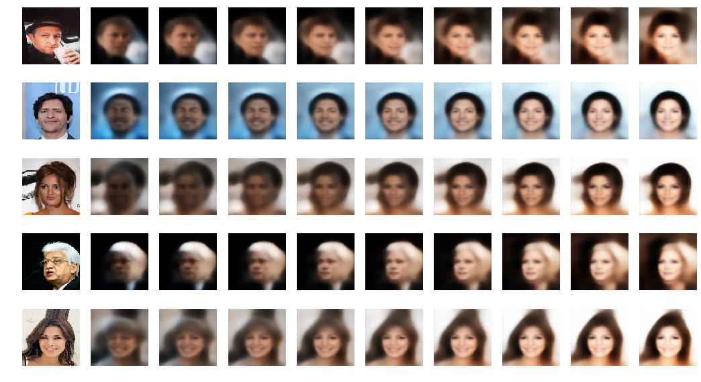


```python
print('Mouth Open Vector')
add_vector_to_images(mouth_open_vec)
```

    Mouth Open Vector
    Found 202599 validated image filenames.
    


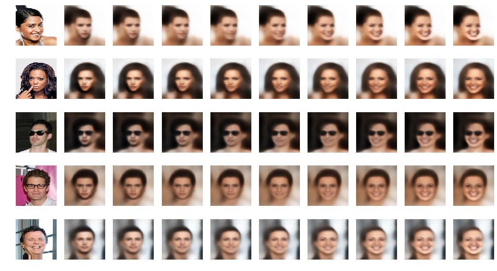


```python
print('Smiling Vector')
add_vector_to_images(smiling_vec)
```

    Smiling Vector
    Found 202599 validated image filenames.
    


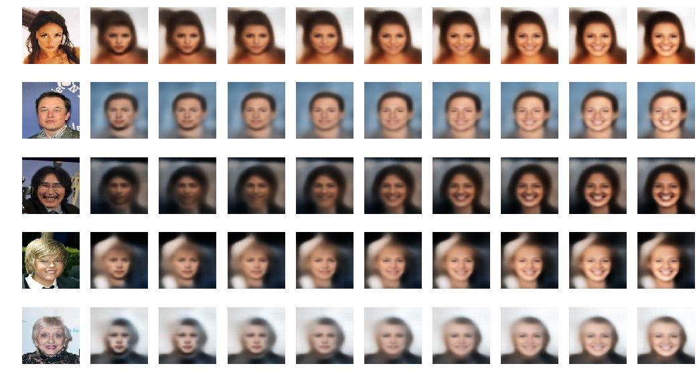


```python
print('Lipstick Vector')
add_vector_to_images(lipstick_vec)
```

    Lipstick Vector
    Found 202599 validated image filenames.
    


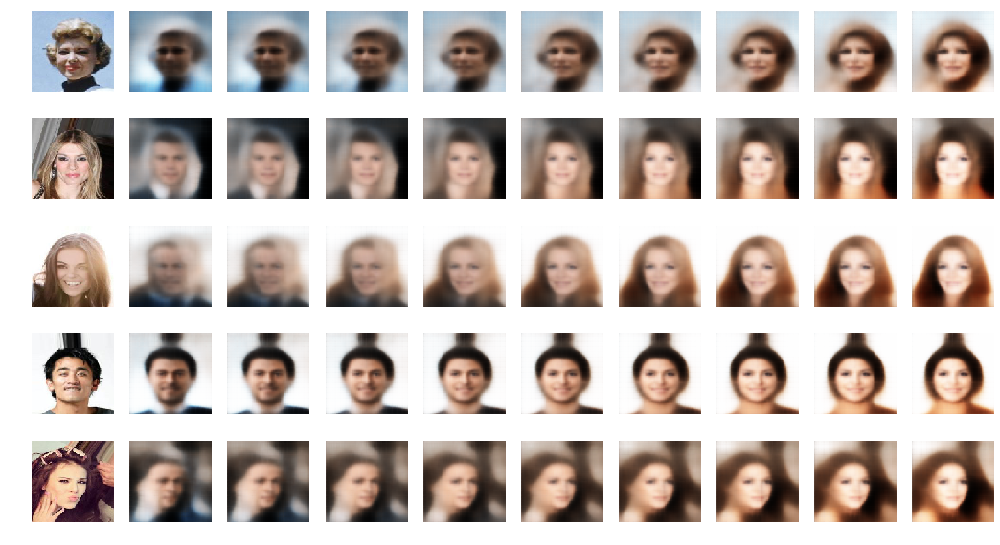


```python
print('Young Vector')
add_vector_to_images(young_vec)
```

    Young Vector
    Found 202599 validated image filenames.
    


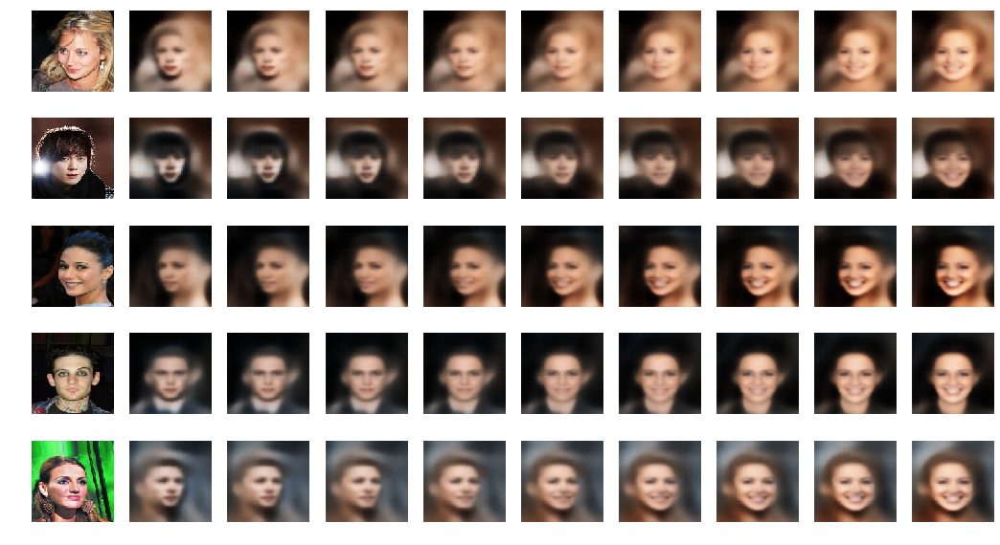


```python
print('Blond Vector')
add_vector_to_images(blonde_vec)
```

    Blond Vector
    Found 202599 validated image filenames.
    


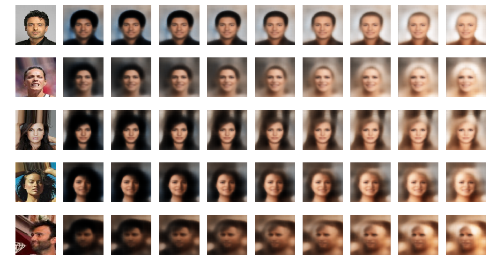


```python
print('Male Vector')
add_vector_to_images(male_vec)
```

    Male Vector
    Found 202599 validated image filenames.
    


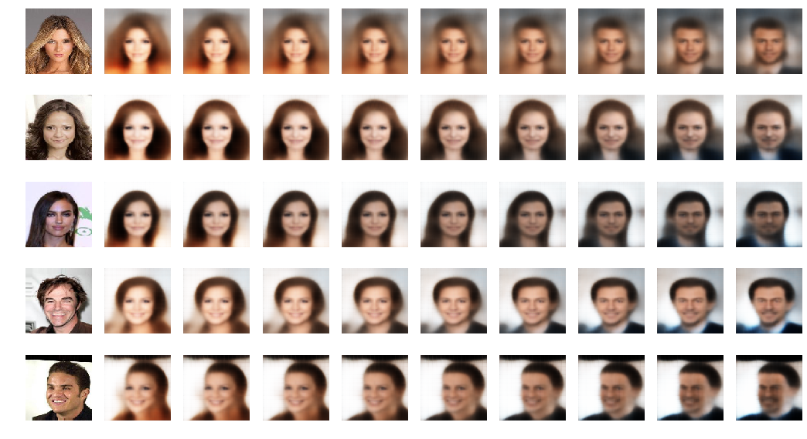


```python
print('Eyeglasses Vector')
add_vector_to_images(eyeglasses_vec)
```

    Eyeglasses Vector
    Found 202599 validated image filenames.
    


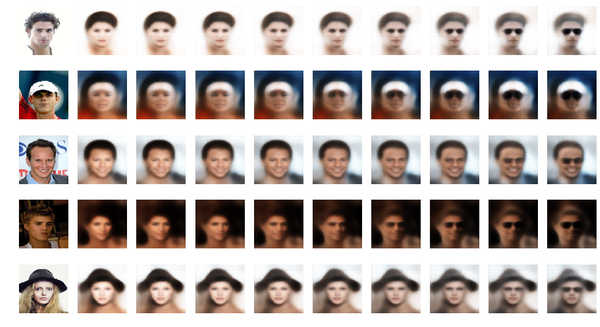


## Face Morphing

Using a similar idea as above to morph between two faces


```python
def morph_faces(start_image_file, end_image_file):

    factors = np.arange(0,1,0.1)

    attr_specific = attr[attr['File_name'].isin([start_image_file, end_image_file])]
    attr_specific = attr_specific.reset_index()
    data_gen = ImageDataGenerator(rescale=1./255)
    data_flow_label = data_gen.flow_from_dataframe(attr_specific, IMAGE_FOLDER, 
                                                   x_col='File_name', 
                                                   target_size=INPUT_DIM[:2] , 
                                                   class_mode='input', 
                                                   batch_size=2, 
                                                   shuffle=True)
    example_batch = next(data_flow_label)
    example_images = example_batch[0]
    example_labels = example_batch[1]

    z_points = vae.encoder.predict(example_images)


    fig = plt.figure(figsize=(18, 8))

    counter = 1

    img = example_images[0].squeeze()
    sub = fig.add_subplot(1, len(factors)+2, counter)
    sub.axis('off')        
    sub.imshow(img)

    counter+=1


    for factor in factors:

        changed_z_point = z_points[0] * (1-factor) + z_points[1]  * factor
        changed_image = vae.decoder.predict(np.array([changed_z_point]))[0]

        img = changed_image.squeeze()
        sub = fig.add_subplot(1, len(factors)+2, counter)
        sub.axis('off')
        sub.imshow(img)

        counter += 1

    img = example_images[1].squeeze()
    sub = fig.add_subplot(1, len(factors)+2, counter)
    sub.axis('off')        
    sub.imshow(img)


    plt.show()
```


```python
start_image_file = '000238.jpg' 
end_image_file = '000193.jpg'

morph_faces(start_image_file, end_image_file)
```

    Found 2 validated image filenames.
    


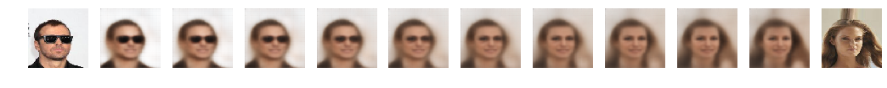


```python
start_image_file = '000112.jpg'
end_image_file = '000258.jpg'

morph_faces(start_image_file, end_image_file)
```

    Found 2 validated image filenames.
    


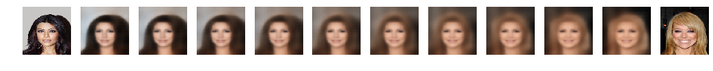


```python
start_image_file = '000230.jpg'
end_image_file = '000712.jpg'

morph_faces(start_image_file, end_image_file)
```

    Found 2 validated image filenames.
    


**The results are not good as SOTA as this was run on colab (k80 GPU), we did try it on AWS on V100 machine but due to some technical problem the dataset was not loading on the machine and hence we had to give up. For paperspace we didn't get the V100 machine to train on. Other than results I have tried to explain everything for a better understanding of whats being done.**
